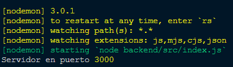
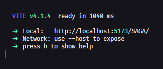

# API_EASY_FACTURE
API Principal de Easy_Facture...

<!-- Banner SAGA -->
<div align="center">
	
  
</div>
<br>
<div align="center">
	
</div>
<br>
  
  
</div>

<!-- Información principal -->
# Easy Facture

Easy_Facture is an educational project aimed at achieving better attendance management. It also includes a section for news and library loans.

<!-- Stack utilizado -->
## Tech Stack

**Client:** <br>
<a href="https://react.dev/" target="_blank" rel="noreferrer"> </a>
<a href="https://es.redux.js.org/" target="_blank" rel="noreferrer"> </a>
<a href="https://getbootstrap.com" target="_blank" rel="noreferrer"> </a>

**Server:** <br>
<a href="https://nodejs.org/es" target="_blank" rel="noreferrer"> </a>
<a href="https://expressjs.com/" target="_blank" rel="noreferrer"> </a>
<a href="https://www.mysql.com/" target="_blank" rel="noreferrer"> </a>
<a href="https://www.mongodb.com/es" target="_blank" rel="noreferrer"> </a>

## Deployment


<p>
  In this project, it is possible that we will use (NPM) for the complete development of the API.
</p>

<div align="center">
	
</div>

<br>

**Production**
<p>
  For production, use:</p>

```bash
  VS star
```
---
### 💻Front-end
<p>
  To run the front-end view, navigate to the root directory of the <a href="./frontend/">frontend</a> 
</p>

<p>
  While here, install the Yarn/npm dependencies, and we utilize Vite<a href="https://vitejs.dev/"> here.</a>
</p>

```bash
  npm install
```
<br>

**Development**
<p>
  If you are using it in a development environment, use:
</p>

```bash
  npm run dev
```
<div align="center">
	
</div>

<br>

**Production**
<p>
For production, use:
</p>

```bash
  npm run deploy
```


<!-- Autores del proyecto -->
## 👨‍💻Authors

- [@Crisfer111](https://github.com/Crisfer111)
- [@CristinaSrng](https://github.com/CristinaStng)

## 👨‍🏫Leaders Instructors
- [@hdtoledo](https://github.com/hdtoledo)

<!-- Documentación oficial -->
## Official Documentation

[Documentación](https://docs.google.com/document/d/1w_XtKgo2KhKu8pUfnynirHXMAwRWFBMZYL8zX1rF_IE/edit?usp=sharing)

(͠≖ ͜ʖ͠≖)👌